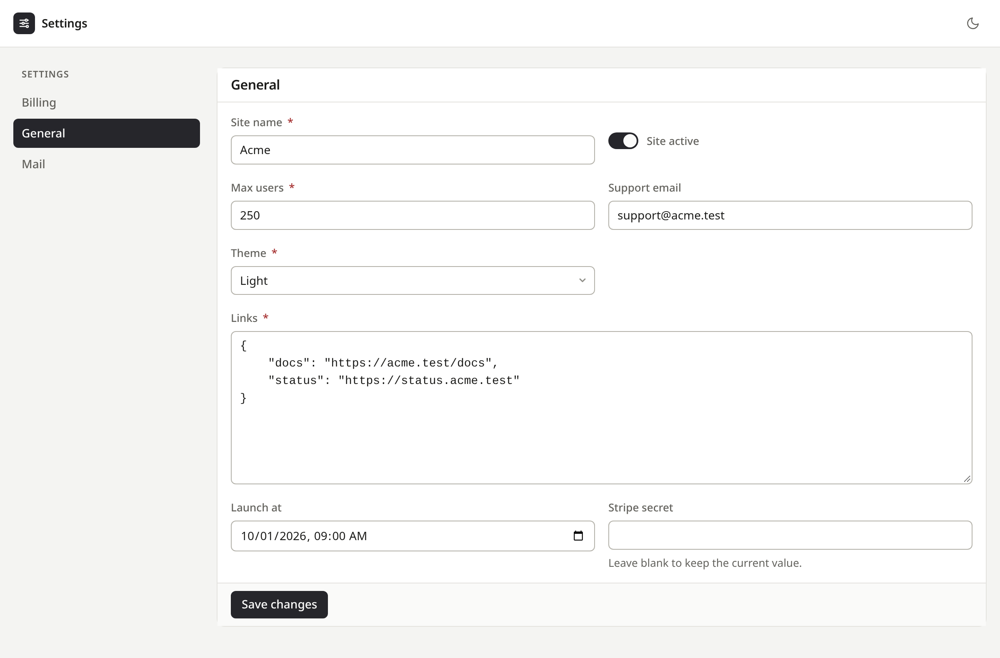

# Spatie Laravel Settings UI

> A plain Blade admin UI for [Spatie's Laravel Settings](https://github.com/spatie/laravel-settings).
>
> A port of [`filament/spatie-laravel-settings-plugin`](https://github.com/filamentphp/spatie-laravel-settings-plugin) with no Filament, Livewire or build step. It **assumes you already use `spatie/laravel-settings`**. It edits your settings classes and does not replace them.



---

## Features

* A page for every settings class, at `/settings-ui`, with no configuration
* Forms guessed from property types: strings, booleans, numbers, enums, dates, arrays
* Custom pages with your own fields, access rules and save hooks
* Encrypted and password properties are never sent to the browser, unless you choose secret fields for them
* Locked properties shown read-only, since Spatie skips them on save
* Authentication, a gate and user/role allow-lists, on by default, and closed outside `local` until you choose who gets in
* Light and dark themes, one stylesheet served by the package

## Requirements

* PHP >= 8.4
* Laravel 13
* [spatie/laravel-settings](https://github.com/spatie/laravel-settings) ^3.0, with its `settings` table migrated

---

## Installation

1. **Install the package**
   ```bash
   composer require wg-vn/spatie-laravel-settings-ui
   ```
2. **Create your settings** as usual with Spatie: a settings class in `app/Settings` and a settings migration. See the [Spatie documentation](https://github.com/spatie/laravel-settings#usage).
3. **Visit the UI**
   ```
   /settings-ui
   ```
   Every settings class that Spatie registers or discovers (`settings.settings` and `settings.auto_discover_settings`) gets a page. Any signed-in user can open it locally. Before deploying, [choose who gets in](#access-outside-local).

**Optional:** publish the resources.
```bash
php artisan vendor:publish --tag="settings-ui-config"        # config/settings-ui.php
php artisan vendor:publish --tag="settings-ui-views"         # resources/views/vendor/settings-ui
php artisan vendor:publish --tag="settings-ui-translations"  # lang/vendor/settings-ui
```

---

## Generated forms

A page with no custom fields guesses its form from the public properties of the settings class:

| Property | Field |
| --- | --- |
| `bool` | toggle |
| `int`, `float` | number (`int` also enforces whole numbers) |
| enum | select, with one option per case |
| `DateTimeInterface` (and Carbon) | date and time |
| `array` | JSON editor |
| encrypted, or a name containing `password` | password, or secret with `'sensitive_field' => 'secret'` |
| name containing `email` / `phone`, `tel` / `url` | email / tel / url |
| anything else | text |

A property that is not nullable is required. Submitted values are converted back to the declared type (int, float, bool, enum, `DateTime` class, or a `spatie/laravel-data` object) before saving.

Password fields never show the stored value. Leaving one blank keeps it. The eye button in the field shows or hides what you type.

Secret fields (`Field::secret()`) are for values an administrator needs to read back, such as API keys. They show the stored value masked, and the eye button reveals it. Leaving one blank clears the value. The value is in the page's HTML, so anyone who can open the page can read it; settings pages are sent with `Cache-Control: no-store`.

---

## Custom pages

Create a page class for a settings class:

```bash
php artisan make:settings-ui-page ManageGeneral GeneralSettings
```

Add `--generate` to write out the guessed fields, so you can edit them. Pages in `app/SettingsUi` are discovered automatically. A page replaces the generated one for its settings class.

```php
namespace App\SettingsUi;

use App\Enums\Theme;
use App\Settings\GeneralSettings;
use WgVn\SettingsUi\Field;
use WgVn\SettingsUi\SettingsPage;

class ManageGeneral extends SettingsPage
{
    protected string $settings = GeneralSettings::class;

    protected ?string $title = 'General';   // defaults to the settings class name
    protected ?string $slug = 'general';    // defaults to the settings group
    protected int $sort = 0;                // navigation order, then title

    public function fields(): array
    {
        return [
            Field::text('site_name')->label('Site name')->required(),
            Field::email('support_email')->help('Shown in the footer.'),
            Field::toggle('maintenance_mode'),
            Field::number('max_uploads')->integer()->min(1)->max(100),
            Field::select('theme')->options(Theme::class),
            Field::select('region')->options(['eu' => 'Europe', 'us' => 'United States']),
            Field::textarea('footer_text')->rules(['max:500']),
            Field::password('api_key'),
            Field::json('social_links'),
            Field::tags('alert_emails')->itemType('email'),
        ];
    }
}
```

The name of each field must match a property of the settings class. Available fields are `text`, `email`, `password`, `secret`, `url`, `tel`, `number`, `textarea`, `toggle`, `select`, `date`, `datetime`, `color`, `json` and `tags`. Each field takes `label()`, `help()`, `placeholder()`, `required()`, `disabled()` and `rules()`. `number` also takes `integer()`, `min()`, `max()` and `step()`. Enum options use a `getLabel()` method when the enum has one. Email fields require a dotted domain, so `user@localhost` is rejected.

Fields render in a two-column grid, filled row by row. `textarea`, `json` and `tags` span both columns. To show related fields under a heading, wrap them in a section. Each section starts a new grid, and fields outside any section keep the plain layout:

```php
use WgVn\SettingsUi\Section;

return [
    Field::text('site_name'),
    Section::make('Uploads', [
        Field::number('max_uploads')->integer()->min(1),
        Field::toggle('allow_svg'),
    ])->description('Applies to every uploaded file.'),
];
```

`tags` edits an `array` property as a list of removable chips. Enter, a comma or leaving the input adds what was typed, and a pasted list becomes one chip per item. Duplicates and blanks are dropped on save. `itemType('email')` or `itemType('url')` validates each item, marking invalid ones as they are added and rejecting them on save. `required()` means at least one item.

### Authorization

```php
public function canAccess(): bool
{
    return auth()->user()->isAdmin();
}

public function canEdit(): bool
{
    return auth()->user()->isAdmin();
}
```

A page that fails `canAccess()` is hidden from navigation and returns `403`. A page that fails `canEdit()` shows a disabled form and refuses saves.

> `canEdit()` only gates saving. It does not stop a user from reading every value on the page. Restrict sensitive settings with `canAccess()` instead.

### Hooks

These work as in the Filament plugin:

```php
protected function mutateFormDataBeforeFill(array $data): array
{
    return $data;
}

protected function mutateFormDataBeforeSave(array $data): array
{
    return $data;
}

protected function beforeSave(): void {}   // also beforeFill, afterFill,
protected function afterSave(): void {}    // beforeValidate, afterValidate

public function getSavedNotificationTitle(): ?string
{
    return 'Settings updated';
}

public function getRedirectUrl(): ?string
{
    return null; // back to the page
}
```

Saving runs in a database transaction, so throwing from a hook rolls it back.

---

## Configuration

```php
return [
    'route' => [
        'prefix' => 'settings-ui',
        'middleware' => null,        // replaces ['web']; auth is always appended
        'domain' => null,
    ],

    'authorization' => [
        'enabled' => true,           // false => the UI is fully public
        'gate' => 'viewSettingsUi',  // default: signed-in users, `local` only
        'guard' => null,
    ],

    'access' => [
        'allowed_users' => [],       // user email allow-list
        'allowed_roles' => [],       // role names (Spatie Permission, etc.)
    ],

    'pages' => [
        'classes' => [],             // custom pages to register explicitly
        'discover' => app_path('SettingsUi'),
        'auto' => true,              // generate pages for the rest
        'exclude' => [],             // settings classes that get no page
    ],

    'ui' => [
        'brand' => 'Settings',
        'logo' => null,
        'back_url' => null,          // header link, e.g. to your admin panel
    ],
];
```

---

## Authorization & access control

Access is decided in this order:

1. **`authorization.enabled`** (default `true`, or `SETTINGS_UI_AUTHORIZATION`) requires a logged-in user, then the gate.
2. **`access.allowed_users` / `access.allowed_roles`**: if either is set, it is enforced **regardless of step 1**.
3. With authorization off **and** both lists empty, the UI is fully public, and anyone who can reach the URL can change your settings. Use that only for local development.

### Access outside `local`

The UI can change every setting in your application, so **outside the `local` environment it denies everyone until you choose who gets in**. Signed-in users see a `403` that explains this. Do one of the following:

* Set an allow-list in `config/settings-ui.php`:
  ```php
  'access' => [
      'allowed_users' => ['admin@example.com'],
      'allowed_roles' => ['admin'],
  ],
  ```
* Or define the gate yourself, for example in `AppServiceProvider::boot()`:
  ```php
  Gate::define('viewSettingsUi', fn ($user) => $user->is_admin);
  ```

In the `local` environment, any signed-in user gets in.

Notes:

* **Gate:** your own `viewSettingsUi` gate replaces the default entirely. The allow-lists still apply on top of it.
* **Roles** use `hasAnyRole()` or `hasRole()` on your user model. Without either method, a user cannot match a role and is denied.
* **`route.middleware`** replaces the base stack (`['web']`) only. Authentication and the access checks are appended afterwards and cannot be removed.
* **Guests** are redirected to your `login` route (or wherever `redirectGuestsTo()` points). Without one, and for JSON requests, they get a `401`.

---

## Translations

The save button and the saved message come in every language the Filament plugin shipped. The rest of the interface is in English. Publish the translations to add or change any of them.

---

## License

The MIT License (MIT). See [LICENSE](LICENSE) for details. Based on `filament/spatie-laravel-settings-plugin`, copyright (c) Filament.
